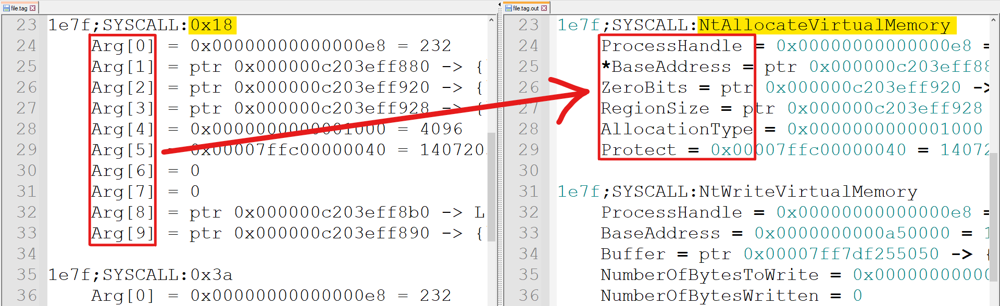

# TinyProcessor

This project replaces syscall numbers & arguments in Tinytracer's `.tag` output w/ their actual `Nt` function declarations for better readability.

> Do note that some functions declarations are not included, so some arguments will not be processed



The function declarations I use in this project are obtained from [CAPE Sandbox](https://github.com/kevoreilly/capemon/blob/capemon/hooks.h) and [NtInternals](http://undocumented.ntinternals.net). In the case of conflicting declarations for the same function, CAPE's declaration will be prioritized since it references MSDN (which is the official documentation site).

## Usage

```
usage: TinyProcessor.py [-h] -file <filename>

options:
  -h, --help        show this help message and exit
  -file <filename>  Takes in a .tag file generated by Tinytracer
```

### Future Plans:

- Remove memory addresses [--remove-addr, -r]
- Add argument direction & type [--verbose, -v]
- Add symbols for normal API calls by scraping `hooks.c`
- Add support for Linux syscalls
- Wrap files using Pyinstaller

